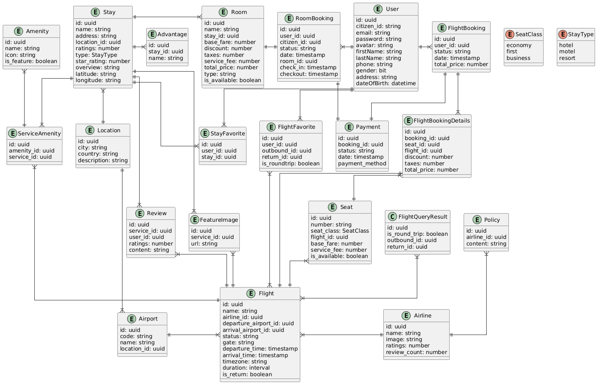

# gogo-travel

### Class Diagram

### run application
`sudo docker run -d \
  --name gogo-travel \
  -e POSTGRES_USER=postgres \
  -e POSTGRES_PASSWORD=postgresadmin \
  -e POSTGRES_DB=GOGO-Travel \
  -e KAFKA_BOOTSTRAP_SERVER=52.64.172.62 \
  -e JWT_SECRET_KEY=0ffd01646fe0d6232f/462781a87b9314aec2811a716aadfc17dee3045423490b \
  -p 8080:8080 \
  --network gogo_postgres \
  --restart unless-stopped \
  thanhloc1087/gogo-travel:0.7.1` 